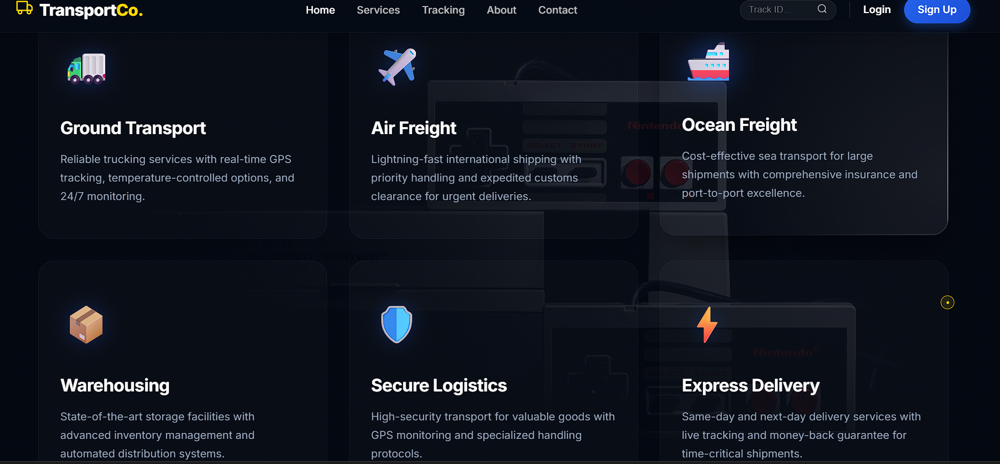
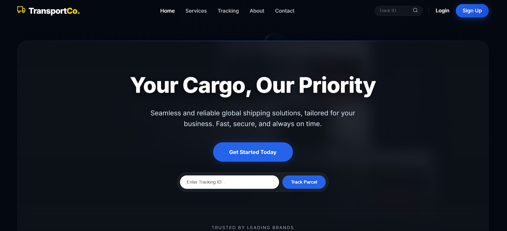

# MooVit

MooVit is an AI-powered real-time object detection and voice-assist system designed to improve road safety and mobility — especially for visually impaired users, logistics operations, and vehicle drivers. It detects people, vehicles, traffic signals, animals, dangerous objects, and known faces, and offers voice alerts for real-time navigation, route optimization, and road safety awareness.

🔗 **Live site:** [https://moo-vit.vercel.app/](https://moo-vit.vercel.app/)

> **Note:** MooVit is currently a static multi-page website. There is no backend server in this repository. All pages are plain HTML/CSS/JS files that can be opened directly in a browser.

---

## 🌐 Web Application

The MooVit web interface is simple, accessible, and packed with functionality:

- Access real-time camera feed for object detection
- Upload image or video files for instant analysis
- Bounding boxes + voice alerts for detected objects and threats
- Responsive interface works on both desktop and mobile
- Shipment route scheduling and alert-based safety recommendations (BETA)
- Safety awareness prompts for road signs, traffic zones, and conditions

Try it now → [https://moo-vit.vercel.app/](https://moo-vit.vercel.app/)

---

## 📸 Project Screenshots

### 🏠 Home / Landing Page


### 🚚 Services Section


---

## ✨ Features

- Detects vehicles, people, signals, and sharp objects
- Recognizes known faces to help visually impaired users follow familiar people
- Real-time voice alerts based on camera/video input
- Vehicle shipment schedule module: input shipment data, receive route timelines
- Route safety planner: avoid known hazard zones or restricted areas
- Traffic awareness: highlights signals, signs, and crossing points
- Upload images or use live camera feed for detection

---

## 📁 Project Structure

This is a **static website** — no backend or build step is required.

```
MooVit/
├── index.html                  # Landing page
├── pages/
│   ├── about.html
│   ├── contact.html
│   ├── login.html
│   └── safety.html
├── Routes/                     # Route safety planner feature
├── Vehicles/                   # Vehicle detection feature
├── Chatbot/                    # Chatbot / voice assistant feature
├── assets/
│   ├── images/                 # UI images and screenshots
│   ├── icons/                  # SVG icons
│   └── styles.css              # Global stylesheet
└── script.js                   # Frontend logic
```

> If your local clone contains additional feature folders or files not listed above, please update this section and open a PR!

---

## 🚀 Local Setup

No installation or build tools required. Just open the project in a browser.

### Option 1 — Open directly (quickest)

```bash
git clone https://github.com/ShubhangiRoy12/moovit.git
cd moovit
# Open index.html in your browser
open index.html          # macOS
start index.html         # Windows
xdg-open index.html      # Linux
```

### Option 2 — VS Code Live Server (recommended for development)

1. Install the [Live Server extension](https://marketplace.visualstudio.com/items?itemName=ritwickdey.LiveServer) in VS Code.
2. Open the `moovit/` folder in VS Code.
3. Right-click `index.html` → **Open with Live Server**.
4. The site will open at `http://127.0.0.1:5500` and auto-reload on file changes.

### Option 3 — Python simple HTTP server

```bash
git clone https://github.com/ShubhangiRoy12/moovit.git
cd moovit
python -m http.server 8080
# Visit http://localhost:8080 in your browser
```

---

## 🛠 Tech Stack

### Computer Vision & AI (planned / integrated via JS)
- YOLOv8 / YOLOv11 / YOLOv12 – object detection
- OpenCV – image and video stream processing
- TensorFlow.js / ONNX Runtime Web – in-browser model inference

### Frontend
- HTML, CSS, JavaScript – page structure and interactivity
- Canvas API – draw real-time detection bounding boxes
- MediaDevices API – access webcam in the browser
- Web Speech API – text-to-speech voice alerts

### Deployment & Tools
- Vercel – static site hosting
- GitHub – version control and CI

---

## 📋 Use Cases

- Assist visually impaired users with voice-based object alerts
- Help logistics teams plan safe and efficient routes
- Offer vehicle drivers route awareness and obstacle warnings
- Provide safety prompts in traffic-heavy or high-risk zones
- Enable face tracking to follow companions in crowded areas

---

## 🚧 Future Plans

- Add backend (Python + Flask / FastAPI) for server-side ML inference
- Multilingual voice support
- GPS-based live routing for shipment vehicles
- Heatmap overlays for high-risk zones
- Admin dashboard to view and edit shipment schedules
- Public API for integration with logistics and assistive apps

---

## 🤝 Contributing

We welcome contributions! This project is part of **OSCG '26**.

You can help with:
- Improving detection accuracy
- Expanding shipment scheduling logic
- UI/UX design improvements
- Adding more face profiles or localization features
- Writing tests or improving documentation

### Steps to contribute

1. Fork this repo
2. Create a branch: `git checkout -b feature/your-feature-name`
3. Make your changes
4. Commit: `git commit -m "feat: describe your change"`
5. Push: `git push origin feature/your-feature-name`
6. Open a Pull Request and describe what you changed and why

**First time contributing?** Start with issues labelled `good first issue` or `documentation`.

---

## 👥 Contributors

- **[Shubhangi Roy](https://github.com/ShubhangiRoy12)** — Project Lead & Machine Learning Engineer
- **[Om Roy](https://github.com/omroy07)** — Web Developer & Machine Learning Engineer

---

## 📜 License

This project is licensed under the **MIT License**. See the [LICENSE](LICENSE) file for details.